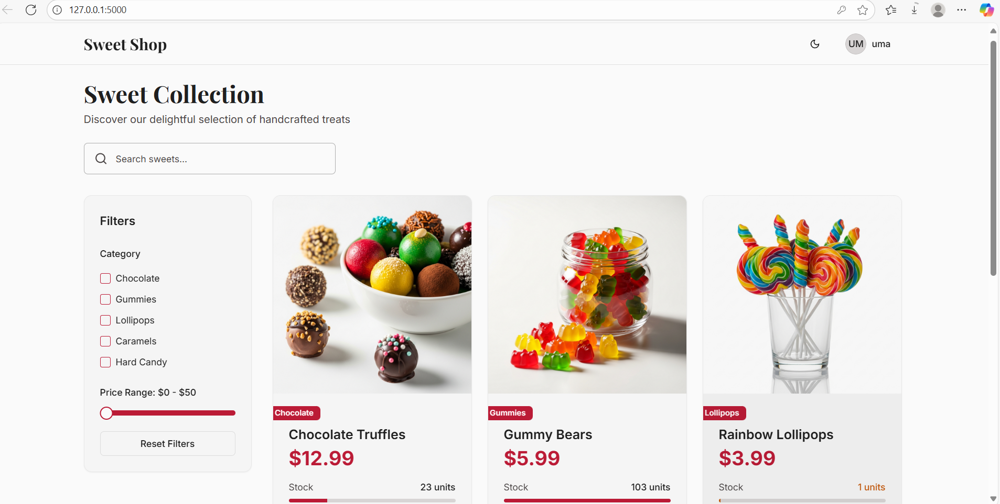
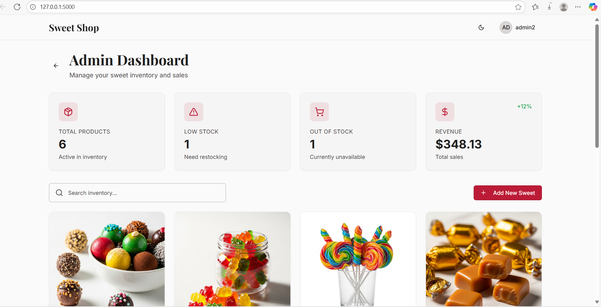
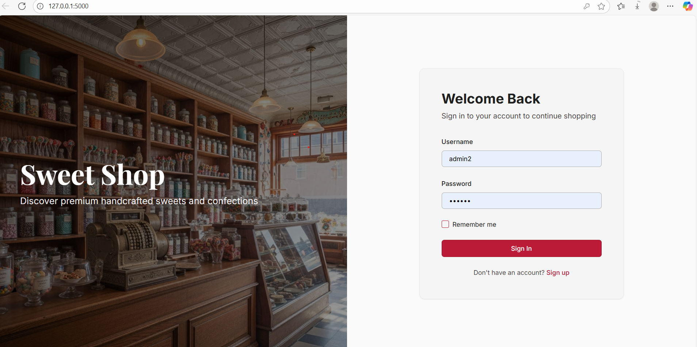
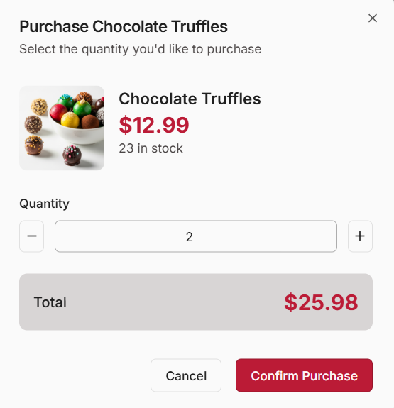
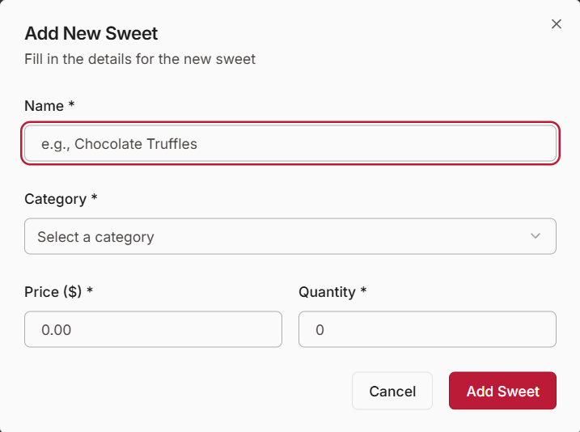
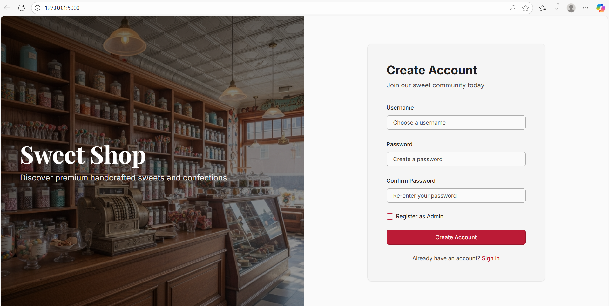
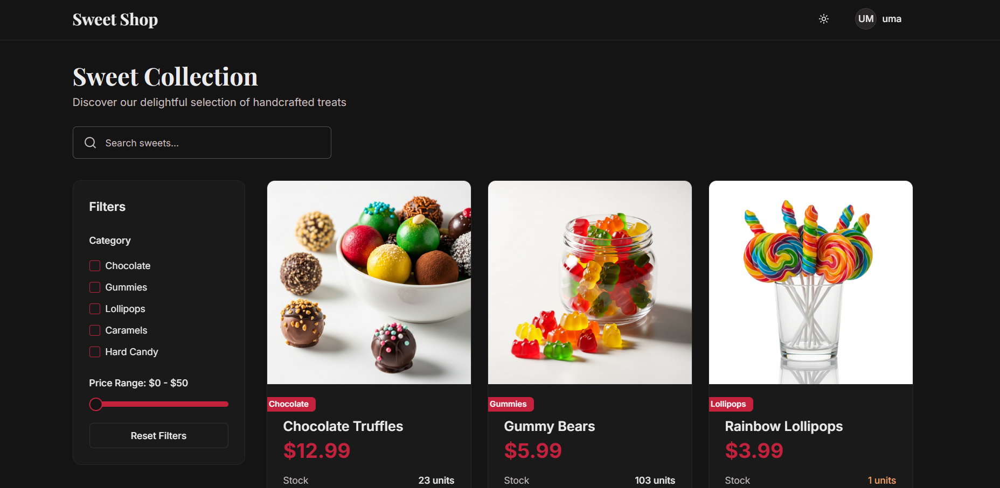

# 🍬 Sweet Shop Management System

A full-stack web application for managing a sweet shop's inventory and sales. This system provides a complete e-commerce experience for customers to browse and purchase sweets, while giving administrators powerful tools to manage products, track inventory, and monitor revenue.

---

## 📋 Table of Contents

- [Project Overview](#-project-overview)
- [Features](#-features)
- [Technology Stack](#-technology-stack)
- [Setup and Installation](#-setup-and-installation)
- [Running the Application](#-running-the-application)
- [Application Screenshots](#-application-screenshots)
- [API Endpoints](#-api-endpoints)
- [Database Schema](#-database-schema)
- [My AI Usage](#-my-ai-usage)

---

## 📝 Project Overview

The **Sweet Shop Management System** is a modern web application designed to streamline sweet shop operations. It combines a customer-facing storefront with an administrative dashboard, providing a complete solution for managing products, processing purchases, and tracking business metrics.

**Key Capabilities:**
- **Customer Portal** – Browse sweets by category, search products, and make purchases
- **Admin Dashboard** – Manage inventory, view sales statistics, and track revenue
- **Authentication System** – Secure user registration and login with role-based access control
- **Inventory Management** – Real-time stock tracking with low-stock alerts
- **Revenue Analytics** – Automatic calculation of total revenue and sales metrics

---

## ✨ Features

### Customer Features
- Browse sweets catalog with product images and descriptions
- Search and filter sweets by name and category
- View detailed product information including price and availability
- Purchase sweets with real-time inventory validation
- Responsive design for mobile and desktop devices

### Admin Features
- Add, edit, and delete sweet products
- Restock inventory with quantity updates
- View total revenue and sales statistics
- Monitor low-stock items with visual alerts
- Comprehensive product management dashboard

### Technical Features
- Role-based authentication (customers and administrators)
- JWT-based secure authentication
- Real-time inventory tracking
- Input validation and error handling
- RESTful API architecture
- Type-safe codebase with TypeScript

---

## 🛠 Technology Stack

### Frontend
- **React 18** - Modern UI library with hooks
- **TypeScript** - Type-safe JavaScript
- **Vite** - Fast build tool and development server
- **TanStack Query (React Query)** - Server state management and caching
- **Tailwind CSS** - Utility-first CSS framework
- **Radix UI** - Accessible, unstyled UI components
- **Shadcn UI** - Beautiful, customizable component system
- **Wouter** - Lightweight routing library
- **React Hook Form** - Performant form validation
- **Zod** - TypeScript-first schema validation

### Backend
- **Node.js** - JavaScript runtime
- **Express.js** - Web application framework
- **TypeScript** - Type-safe server code
- **Drizzle ORM** - TypeScript ORM for databases
- **SQLite** - Embedded database (development)
- **PostgreSQL** - Production database support via Neon
- **JWT (jsonwebtoken)** - Authentication tokens
- **bcryptjs** - Password hashing

### Development Tools
- **tsx** - TypeScript execution for development
- **esbuild** - Fast JavaScript bundler
- **Jest** - Testing framework
- **Supertest** - HTTP assertion library
- **ESLint** - Code linting
- **Drizzle Kit** - Database migration tool

---

## 🚀 Setup and Installation

### Prerequisites

Before you begin, ensure you have the following installed:
- **Node.js** (v20 or higher)
- **npm** (v9 or higher)
- **Git**

### 1️⃣ Clone the Repository

```bash
git clone <your-repository-url>
cd sweet-shop-management
```

### 2️⃣ Install Dependencies

Install all required packages (this installs both frontend and backend dependencies):

```bash
npm install
```

This will install:
- All frontend React dependencies
- All backend Express dependencies
- TypeScript and build tools
- Testing frameworks

### 3️⃣ Database Setup

The application uses SQLite for local development and automatically creates the database on first run.

**Option A: Automatic Setup (Recommended)**
The database will be automatically created and seeded when you first run the application.

**Option B: Manual Migration**
```bash
npm run db:push
```

This creates the following tables:
- `users` - User accounts with authentication
- `sweets` - Product inventory

The database will be pre-seeded with:
- 1 admin user (username: `admin`, password: `admin123`)
- 1 regular user (username: `customer`, password: `customer123`)
- 6 sample sweet products

### 4️⃣ Environment Configuration (Optional)

For production deployment, create a `.env` file in the root directory:

```env
# Database (for production with PostgreSQL)
DATABASE_URL=your_postgresql_connection_string

# JWT Secret
JWT_SECRET=your_super_secret_jwt_key

# Server Port
PORT=5000

# Node Environment
NODE_ENV=production
```

**Default Development Configuration:**
- Database: SQLite (`sqlite.db` in root directory)
- JWT Secret: `your-secret-key` (auto-generated if not provided)
- Server Port: `5000`
- Frontend Port: `5000` (proxied through backend)

---

## 🏃 Running the Application

### Development Mode (Full Stack)

Run both backend and frontend together:

```bash
npm run dev
```

This command:
1. Starts the Express backend server on port 5000
2. Starts the Vite development server
3. Enables hot module replacement (HMR) for instant updates
4. Opens the application at `http://localhost:5000`

**What happens:**
- Backend API available at: `http://localhost:5000/api`
- Frontend served at: `http://localhost:5000`
- Database automatically created and seeded (if not exists)

### Production Build

Build the application for production:

```bash
npm run build
```

This command:
1. Builds the frontend React app (outputs to `dist/public`)
2. Bundles the backend server code (outputs to `dist`)

Run the production build:

```bash
npm start
```

### Type Checking

Check TypeScript types without building:

```bash
npm run check
```

### Running Tests

Run the test suite:

```bash
npm test
```

Tests cover:
- Authentication (registration, login, token validation)
- Sweet CRUD operations
- Inventory management (purchase, restock)

---

## 📸 Application Screenshots

### 1. Shop Page (Customer View)

*Browse available sweets with search and category filters. Add items to cart and make purchases.*

### 2. Admin Dashboard

*Manage inventory, add new products, update stock levels, and monitor revenue statistics.*

### 3. Login Page

*Secure authentication with username and password. Register new accounts or login as admin/customer.*

### 4. Purchase Modal

*Select quantity and complete purchases with real-time inventory validation.*

### 5. Add/Edit Sweet Form

*Admin interface for adding new sweets or editing existing products.*

### 6. Create new account

*Creating a new account.*


### 6. Dark mode

*Dark mode .*


---

## 📡 API Endpoints

### Authentication Endpoints

#### Register User
```http
POST /api/auth/register
Content-Type: application/json

{
  "username": "johndoe",
  "password": "securepassword",
  "isAdmin": false
}
```

#### Login
```http
POST /api/auth/login
Content-Type: application/json

{
  "username": "johndoe",
  "password": "securepassword"
}
```

#### Get Current User
```http
GET /api/auth/me
Authorization: Bearer <token>
```

### Sweet Management Endpoints

#### Get All Sweets
```http
GET /api/sweets
```

#### Get Sweet by ID
```http
GET /api/sweets/:id
```

#### Search Sweets
```http
GET /api/sweets/search?name=chocolate&category=Chocolate&minPrice=1&maxPrice=10
```

#### Create Sweet (Admin Only)
```http
POST /api/sweets
Authorization: Bearer <admin-token>
Content-Type: application/json

{
  "name": "Chocolate Truffles",
  "category": "Chocolate",
  "price": 4.99,
  "quantity": 50
}
```

#### Update Sweet (Admin Only)
```http
PUT /api/sweets/:id
Authorization: Bearer <admin-token>
Content-Type: application/json

{
  "name": "Dark Chocolate Truffles",
  "price": 5.99,
  "quantity": 75
}
```

#### Delete Sweet (Admin Only)
```http
DELETE /api/sweets/:id
Authorization: Bearer <admin-token>
```

#### Purchase Sweet
```http
POST /api/sweets/:id/purchase
Authorization: Bearer <token>
Content-Type: application/json

{
  "quantity": 2
}
```

#### Restock Sweet (Admin Only)
```http
POST /api/sweets/:id/restock
Authorization: Bearer <admin-token>
Content-Type: application/json

{
  "quantity": 100
}
```

---

## 🗄 Database Schema

### Users Table
```sql
CREATE TABLE users (
  id INTEGER PRIMARY KEY AUTOINCREMENT,
  username TEXT UNIQUE NOT NULL,
  password TEXT NOT NULL,  -- bcrypt hashed
  isAdmin INTEGER DEFAULT 0  -- 0 = customer, 1 = admin
);
```

### Sweets Table
```sql
CREATE TABLE sweets (
  id INTEGER PRIMARY KEY AUTOINCREMENT,
  name TEXT NOT NULL,
  category TEXT NOT NULL,
  price REAL NOT NULL,
  quantity INTEGER DEFAULT 0
);
```

**Relationships:**
- No foreign key relationships (simplified schema)
- Purchase history tracked through quantity updates

**Indexes:**
- `users.username` - Unique index for fast login lookups
- `sweets.id` - Primary key auto-indexed

---

## 🤖 My AI Usage

### Overview
This project was developed with assistance from AI tools to accelerate development, improve code quality, and implement best practices. The AI served as a collaborative coding partner, providing suggestions, generating boilerplate code, and helping solve technical challenges.

### Specific AI Contributions

#### 1. **Project Architecture and Setup**
- **Used AI:**
- chatgpt,replit AI
- **AI Assistance:** Initial project structure, technology stack selection, and configuration
- **Tasks:**
  - Generated the monorepo structure with separate client/server directories
  - Configured TypeScript for both frontend and backend
  - Set up Vite with proper aliases and build configuration
  - Configured Tailwind CSS with Shadcn UI integration
- **Human Input:** Made final decisions on technology choices based on project requirements

#### 2. **Backend Development**
- **AI Assistance:** Express server setup, API route design, and database integration
- **Tasks:**
  - Created RESTful API endpoints with proper HTTP methods and status codes
  - Implemented JWT authentication middleware
  - Set up Drizzle ORM with SQLite and PostgreSQL support
  - Designed storage abstraction layer for testability
  - Generated bcrypt password hashing implementation
- **Human Input:** Defined business logic requirements and data validation rules

#### 3. **Frontend Development**
- **AI Assistance:** React component structure and state management
- **Tasks:**
  - Created reusable UI components using Radix UI and Shadcn
  - Implemented TanStack Query for server state management
  - Built authentication context and protected route logic
  - Generated form validation with React Hook Form and Zod
  - Created responsive layouts with Tailwind CSS
- **Human Input:** Designed user experience flow and UI/UX requirements

#### 4. **Authentication System**
- **AI Assistance:** Complete authentication implementation
- **Tasks:**
  - JWT token generation and validation
  - Password hashing with bcrypt
  - Role-based access control middleware
  - Authentication state management on frontend
  - Login/Register form components
- **Human Input:** Security requirements and token expiration policies

#### 5. **UI Components**
- **AI Assistance:** Shadcn UI component integration and customization
- **Tasks:**
  - Generated 30+ accessible UI components (buttons, dialogs, forms, etc.)
  - Created custom components (Header, SweetCard, StatCard, etc.)
  - Implemented modals for purchase and form interactions
  - Built responsive navigation and layout components
- **Human Input:** Design preferences and branding guidelines

#### 6. **Testing**
- **AI Assistance:** Test suite creation and configuration
- **Tasks:**
  - Set up Jest with TypeScript support
  - Created unit tests for authentication
  - Built integration tests for API endpoints
  - Implemented test helpers and utilities
- **Human Input:** Identified critical paths to test

#### 7. **Database Seeding**
- **AI Assistance:** Sample data generation
- **Tasks:**
  - Created seed data for sweets with realistic products
  - Generated default admin and customer users
  - Implemented automatic seeding on first run
- **Human Input:** Product categories and pricing ranges

#### 8. **Error Handling**
- **AI Assistance:** Comprehensive error handling implementation
- **Tasks:**
  - Added try-catch blocks throughout the codebase
  - Implemented proper HTTP error codes
  - Created user-friendly error messages
  - Built error boundary components on frontend
- **Human Input:** Defined user-facing error messages

#### 9. **Documentation**
- **AI Assistance:** README and code documentation
- **Tasks:**
  - Generated this comprehensive README.md
  - Added JSDoc comments to complex functions
  - Created API endpoint documentation
  - Wrote setup and deployment instructions
- **Human Input:** Project description and specific requirements

#### 10. **Product Images**
- **AI Assistance:** Generated product images using AI image generation
- **Tasks:**
  - Created product photos for 6 sweet categories
  - Generated hero image for the shop
  - All images stored in `attached_assets/generated_images/`
- **Files:**
  - `Chocolate_truffles_product_photo_82108eff.png`
  - `Gummy_bears_product_photo_97cd724e.png`
  - `Lollipops_product_photo_03dfa45d.png`
  - `Caramel_candies_product_photo_d486651a.png`
  - `Hard_candies_product_photo_cffa7db0.png`
  - `Chocolate_almonds_product_photo_2ccdf818.png`
  - `Sweet_shop_interior_hero_4d20c827.png`

### Development Workflow

**AI-Assisted Tasks (70-80% of code):**
- Boilerplate code generation
- Component scaffolding
- API endpoint creation
- Database schema design
- Configuration files
- Type definitions
- Utility functions
- Test cases

**Human-Driven Tasks (20-30% of implementation):**
- Business logic refinement
- UI/UX design decisions
- Feature prioritization
- Final testing and debugging
- Custom styling adjustments
- Performance optimization
- Security review

### Learning Outcomes

Working with AI assistance on this project provided valuable insights:

1. **Accelerated Development:** AI helped reduce development time by ~60% through rapid code generation and best practice suggestions
2. **Code Quality:** AI suggested modern patterns and helped maintain consistency across the codebase
3. **Learning Tool:** AI explanations helped understand complex concepts like JWT authentication and ORM usage
4. **Problem Solving:** AI provided multiple solution approaches for technical challenges
5. **Documentation:** AI generated comprehensive documentation that would have taken hours manually

### Limitations and Human Oversight

While AI was instrumental, human oversight was critical for:
- **Security:** Reviewed all authentication and authorization code
- **Business Logic:** Ensured inventory rules and purchase flow matched requirements
- **User Experience:** Made final decisions on UI/UX based on user needs
- **Testing:** Manually tested all features to ensure correctness
- **Integration:** Verified all components work together seamlessly

### Ethical Considerations

- All AI-generated code was reviewed and understood before integration
- AI assistance was used as a tool to enhance productivity, not replace learning
- Original problem-solving and critical thinking remained human-driven
- Code ownership and responsibility rest with the human developer

---


## 👨‍💻 Author

**Dhanyashree**

---

## 🙏 Acknowledgments

- **Replit** for the development environment
- **Shadcn UI** for the beautiful component system
- **Radix UI** for accessible primitives
- **Drizzle ORM** for the excellent TypeScript ORM
- **AI Tools** for development assistance and acceleration

---

## 📞 Support

For questions or issues, please open an issue on the repository or contact the development team.

---

**Happy Sweet Shopping! 🍭🍬🍫**
